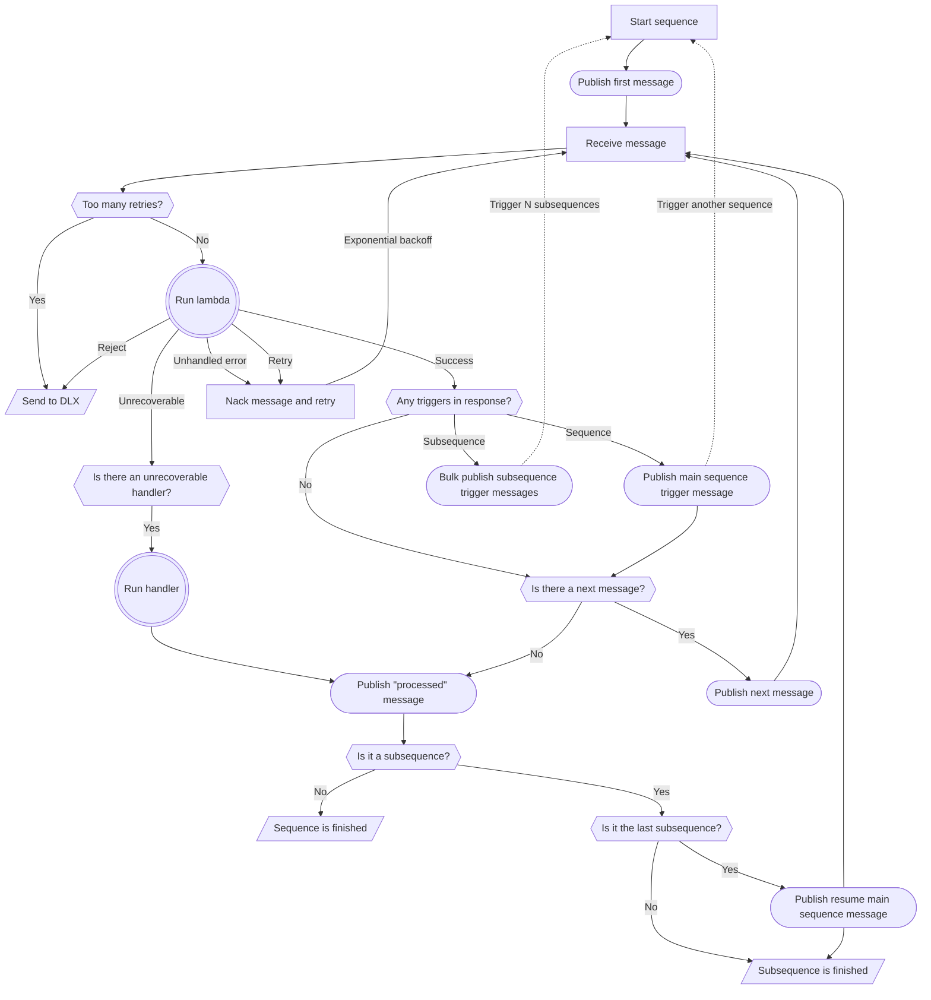

# b0rker

A message broker based on Google [Cloud Tasks](https://cloud.google.com/tasks/docs) (or [PubSub](https://cloud.google.com/pubsub/docs)).

## Features

`b0rker` is a framework for running sequences small functions (also known as lambdas) to perform complex and sensitive tasks, such as collecting payments.
Each lambda should perform a single state change, and should be idempotent (and ideally, atomic, as neither Cloud Tasks nor PubSub (push) can guarantee exactly-once delivery).

## Config needed

Can be either set with config as below or with environment variables when invoking the application.

| Option                    | Description                                                                                                     |
| ------------------------- | --------------------------------------------------------------------------------------------------------------- |
| cloudTasks_queues_default | name of the Cloud Tasks queue, in the format `projects/<project name>/locations/<location>/queues/<queue name>` |
| cloudTasks_selfUrl        | URL to the application itself                                                                                   |
| cloudTasks_localPort      | Only used when running local Cloud Tasks Emulator                                                               |
| jobStorage                | could be either `memory` or `firestore`                                                                         |
| deadLetterTopic           | name of the dead letter topic (PubSub is still used to deliver DLX messages)                                    |

```json
{
  "cloudTasks": {
    "selfUrl": "https://b0rker.bn.nr",
    "queues": {
      "default": "projects/project-id/locations/location/queues/foo-queue"
    }
  },
  "jobStorage": "memory",
  "topic": "topic",
  "deadLetterTopic": "dead-letter-topic"
}
```

## Config needed (PubSub legacy)

Can be either set with config as below or with environment variables when invoking the application.

| Option          | Description                             |
| --------------- | --------------------------------------- |
| jobStorage      | could be either `memory` or `firestore` |
| topic           | name of the topic                       |
| deadLetterTopic | name of the dead letter topic           |

### Example: ./config/$NODE_ENV.json

```json
{
  "jobStorage": "memory",
  "topic": "topic",
  "deadLetterTopic": "dead-letter-topic"
}
```

## Example usage

```js
import { start, route } from "b0rker";

import getOrder from "./lib/lambdas/get-order.js";
import { orderProcessing, orderProcessed } from "./lib/lambdas/order-state.js";
import createInvoice from "./lib/lambdas/create-invoice.js";
import collectPayment from "./lib/lambdas/collect-payment.js";

start({
  recipes: [
    {
      namespace: "sequence",
      name: "process-order",
      sequence: [
        route(".get.order", getOrder),
        route(".update.order-state--processing", orderProcessing),
        route(".perform.create-invoice", createInvoice),
        route(".perform.collect-payment", collectPayment),
        route(".update.order-state--processed", orderProcessed),
      ],
    },
  ],
});
```

## Flowchart

Running a sequence from start to finish can be roughly described by the following flowchart:


